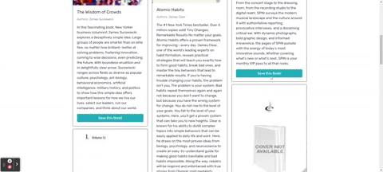

# PAGES - A Book Search Engine
  

  ## Description
  
  - To exercise my developing REACT.js skills, I took starter code with a fully functioning book API search engine built with a RESTful API backend and refactored it to be a GraphQL API built with Apollo Server. The app was built using the MERN stack with a React front end, MongoDB database, and Node.js/Express.js server and API.
  - To make the GraphQL API and Apollo Server possible, I implemented the following React Hooks and techniques :
    - TypeDefs and Resolvers
    - Queries and Mutations
    - JSON Web Tokens, JWB
    
    
  The following are animations of the application in use.

   
    
   
   
  ## Table of Contents
   
  - [Installation](#installation)
  - [Usage](#usage)
  - [Credits](#credits)
  - [License](#license)
  - [How To Contribute](#how_to_contribute)
  - [Tests](#tests)
  - [Questions](#questions)
  
  ## Installation
  
  To install the application:
  1) Have [NODE.js](https://nodejs.org/en/download/) installed on your computer. 
  2) Clone my [GitHub](https://github.com/CM-GDev/Pages-A-Book-Search-Engine) repo for this application.
  3) From the root of your project folder and from the command-line, run "npm install" to install the required dependencies for the application
  4) Next run "npm run develop" to have the application run live on your local computer
  
  ## Usage
  
  I have also deployed the full-stack application to Heroku, [PAGES](https://arcane-citadel-66789.herokuapp.com/)   
    
  ## Credits

  For this homework assignment, I relied on the React.js [documentation](https://reactjs.org/)  
  
  ## License
  
  MIT License

  Copyright (c) [2022] [Cristobal Marquez-Glynn]
  
  ## How to Contribute
  
  - [Contributor Covenant](https://www.contributor-covenant.org/) 
  - I'm open to suggestions on how to improve this product.
  
  ## Tests
  
  N/A
  
  ## Questions
   
  For any questions, you can reach me through my [GITHUB](https://github.com/CM-GDev) or email: cristobalmqz@gmail.com account. 
